1 引言
1.1 编写目的
本文档旨在对《沙河路双报到系统》的功能及操作方法进行描述，帮助用户掌握该系统的使用方法。
1.2 适用对象
本文档适用于测试人员、管理人员等使用该系统的操作人员。
1.3 通用操作说明
【搜索】按钮：查询符合条件的信息。
【添加】按钮：打开新建窗口，新建相应类型的信息。
【修改】按钮：打开修改窗口，修改并保存当前数据行的详细信息。
【删除】按钮：删除当前数据行，删除时会有相应提示操作。
【导出】按钮：导出当前已选中的数据。
2 系统运行环境需求
硬件运行环境包括服务器硬件环境、客户端计算机硬件配置环境，详见下表。
表2.1-1 客户端计算机软硬件配置环境
配置	硬件规格要求
处理器	双核2.0G以上
内存	2G以上
硬盘	100G以上
显示器	分辨率：1920*1080；显示比例：100%
浏览器	谷歌浏览器；显示比例：100%

3 系统功能介绍
3.1 登录系统
在浏览器地址栏中输入系统的访问地址，进入登录界面。在用户名框、密码框输入正确的用户登录名和密码，单击【登录】按钮即可登录本系统。系统将根据用户的身份及权限范围进入相应的系统主界面，若用户名、密码输入错误，或者不输入用户名、密码，则不能登录本系统。本文以系统管理员用户对系统功能进行描述。
3.2 主界面 
图文结合对系统首页操作进行描述，主界面主要分别三个部分：
单击左上角【首页】按钮，系统转换到登录后默认主界面。
单击右上角【用户名】按钮，修改密码或者退出系统关闭当前界面。
左边侧边栏为功能栏，可查看使用系统功能。
 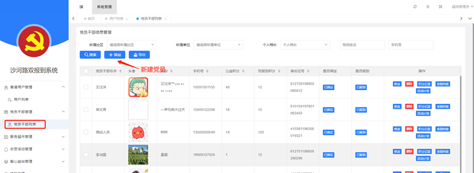
3.4 普通用户管理
系统普通用户信息会在信息管理中统一记录，管理员可以查看、修改会员信息。
 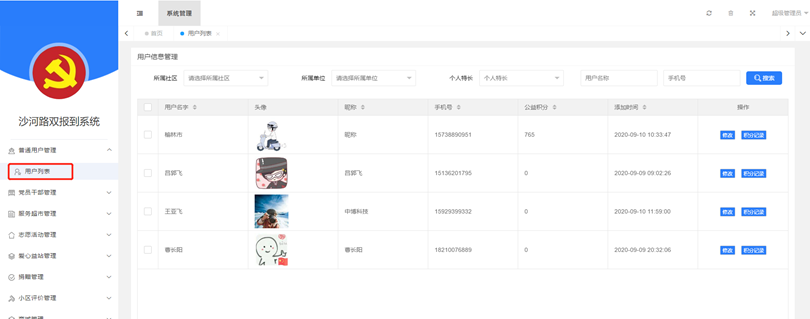
3.5 党员干部管理
党员干部信息需要在这里进行录入，管理员可以对党员信息进行新增、修改和删除。也可以查看党员积分记录。
 
 
积分记录
可查看党员积分记录，管理员可进行积分加减操作
 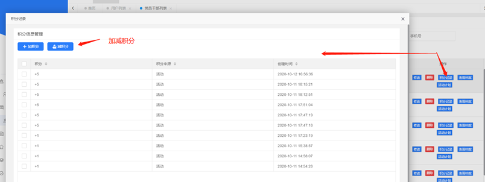
 
表现档案
党员参与的项目或者是党员上报的项目统一再表现档案中展示出来，管理员可对党员参与项目进行审核、认证操作。
 
活动计划
党员可以再手机端个人中心填写自己活动计划，管理员可以再党员干部列表查看党员活动计划信息。
 
3.6 服务超市管理
3.6.1 需求管理
3.6.1.1 需求列表
用户发布的需求信息，会在管理端审核列表页面展示，审核通过的需求可在需求列表查看。已通过审核的需求管理员可以点击添加项目来进行新项目创建。
 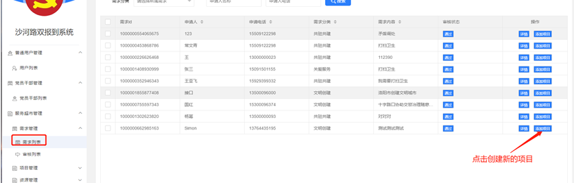
3.6.1.2 审核列表
用户发布需求都需要管理员进行审核，未通过审核的需求，系统会给到发布者下发通知消息，发布者可以在个人中心——消息中心查看。
 
 
3.6.2 项目管理
双报到系统项目活动信息都是在项目列表中进行管理，管理员可新增、删除、修改项目信息。已创建的项目管理员可以查看项目认领记录；对项目评价进行管理；手动进行会员报名操作。
 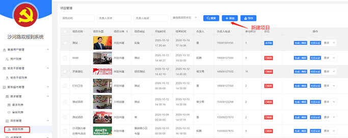
 
认领记录查看
 
评价记录查看
 
手动报名
 
3.6.2.1 审核列表
党员干部可以在手机端服务超市—项目清单中来发布项目活动，已发布的项目活动会在项目管理—审核列表展示，管理员可对项目进行审核、编辑。已通过审核的项目会在手机端项目清单中展示出来。
 
3.6.3 资源管理
3.6.3.1 资源列表
用户发布资源信息都需要管理员进行审核，审核通过后可在小程序资源清单中查看申请，未通过审核的资源，系统会下发消息提醒，发布者可以在个人中心——消息中心进行查看不通过原因。
 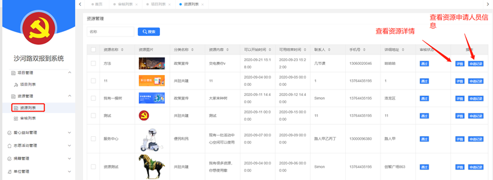
3.6.3.2 审核列表
管理员可以在审核列表查看用户发布的资源信息并进行审核。
 
3.7 志愿活动管理
3.7.1 活动列表
双报到上活动信息都是在志愿活动管理中进行管理，管理员可进行新增、修改、删除活动。已创建的活动管理员可以查看报名记录、管理服务记录、手动给到用户报名、社区认证。
 
 
查看报名记录
 
服务记录
 
报名
 
社区认证
管理员可以进行社区认证，认证后会结算活动积分给到参与人员。
 
3.7.2 审核列表
用户发起活动申请需要管理员进行审核，管理员审核活动时需要编辑该活动参与可获得积分、是否需要签到、活动最大参与人数信息。活动审核通过后，用户可通过小程序端进行活动报名。未通过审核的活动，申请者会收到审核不通过消息。
 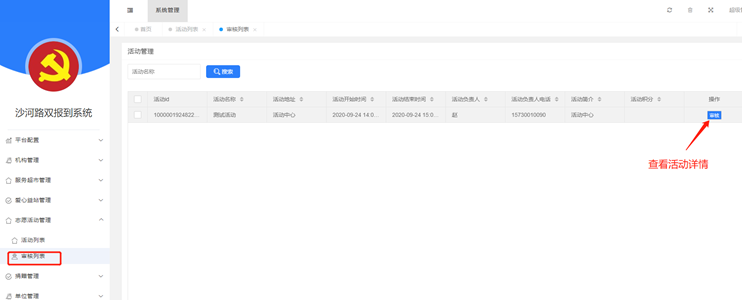
 
3.8 爱心益站管理
3.8.1 商家列表
用户在小程序申请店铺信息，需要管理员进行审核后可在小程序端爱心益站中展示出来。单个用户只可申请一家店铺。
 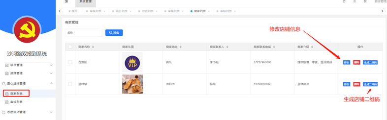
3.8.2 审核列表
用户申请的店铺信息，管理员可以在审核列表查看并审核，已通过审核会在小程序端爱心益站展示店铺信息，未通过审核的店铺，系统会给到申请者下发消息通知，申请者可在个人中心——信息中心查看未通过原因。
 
3.9 捐赠列表
3.9.1 捐赠列表
用户在小程序端发起的捐赠信息都会在捐赠列表展示，管理员可以查看捐赠信息详情。
 
3.9.2 捐赠描述
捐赠描述信息是用来描述捐赠现金、物资的一些要求，或者注意事项。
 
  
3.10 小区评价
小区评价采用第三方腾讯问卷工具，我们在问卷工具上设置好问卷调查，把生成小程序码上传到小区评价配置页面即可。
 
3.11 商城管理
3.11.1 产品管理
产品管理用来添加积分兑换商品，秒杀的商品也是需要在产品中进行选择。
 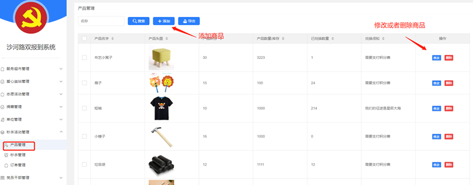
 
3.11.2 秒杀管理
创建秒杀商品活动，秒杀商品必须是已经创建好的产品，并且当一个商品处于秒杀活动时间，积分兑换页面不在展示该商品信息。
 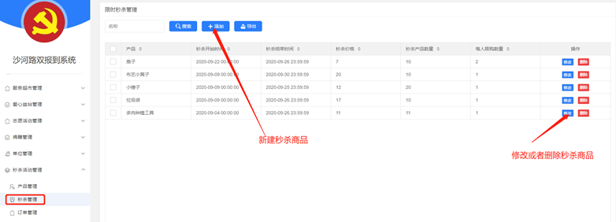
 
3.11.3 订单管理
小程序端用户兑换的商品信息可以在订单管理查询，用户兑换商品已领取可以在订单状态上设置为已兑换。
 
3.12 机构管理
3.12.1 机构列表
机构管理用来添加机构简介信息，可对机构简介进行修改和删除操作。
 
 
3.13 单位管理
单位管理用来添加社区下的单位信息，管理员可以进行添加、修改、删除单位信息。添加单位时要注意查看该单位的社区信息是否添加。
 
 
3.14 平台配置
3.14.1 商家分类
爱心益站的商家分类管理，我们可以进行增加、删除、修改分类信息，需要注意一点，如果删除的分类下面存在商户信息，该分类删除后需要给商户重新分配分类。
 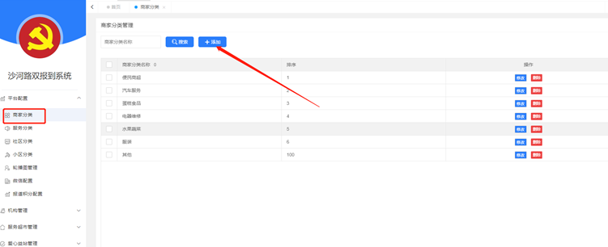
 
3.14.2 服务分类
服务分类管理，可以新增、删除、修改分类信息，该分类主要用于项目新建、需求发布、资源发布时选择分类信息。
 
 
3.14.3 社区分类
社区账号管理，可以新建社区账号，该账号可用于登录双报到管理系统，用来管理社区相关信息。若社区账号密码遗忘，可以在社区分类管理中进行重置。 
 

3.14.4 小区分类
小区分类管理用于新增、修改、删除社区下小区信息。新建小区时要注意确认社区是否已经添加。
 
 
3.14.5 轮播图管理
小程序首页顶部轮播图展示，可配置轮播展示图片以及跳转链接。
 
 
3.14.6 微信配置
微信配置是用来配置系统关联的小程序的app ID和secret，若小程序相关信息未做变动，不建议修改改配置信息。
 
3.14.7 报到积分配置
报道积分配置用来调整报道奖励积分信息，该配置项只能修改不能做删除操作。
 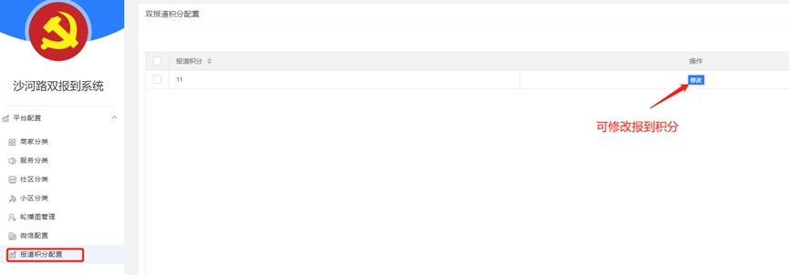
3.15 系统管理
3.15.1 用户管理
添加登录系统用户账号，我们可以根据需要新增用户，新增用户后需要给到用户分配角色，这样用户登录系统后可以根据角色不同看到权限也是不一样的。
 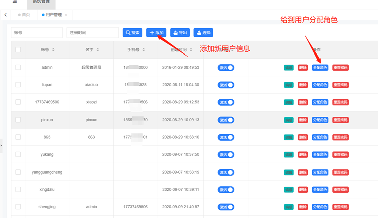
3.15.2 角色管理
添加不同角色信息，可根据角色不同分配不同权限。
 
 
3.15.3 菜单管理
3.15.4 登录日志
记录登录系统的人员信息，我们可以查看到哪个用户在什么时间登录了系统，该用户使用ip地址信息。
 
